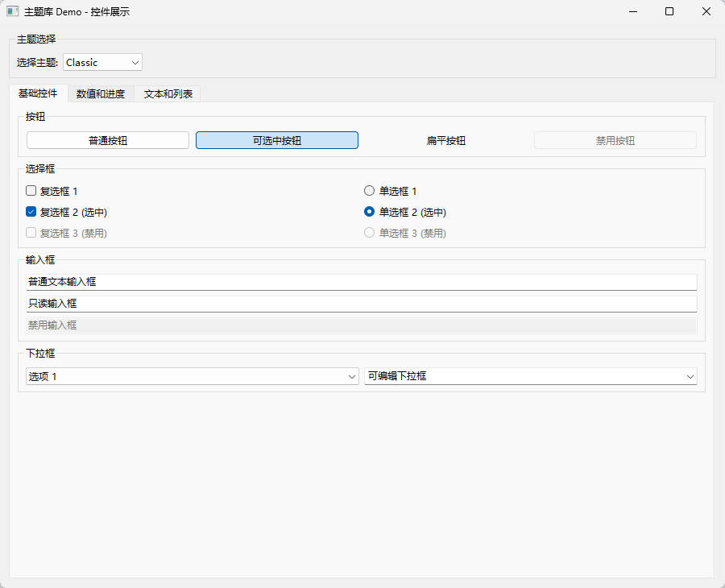
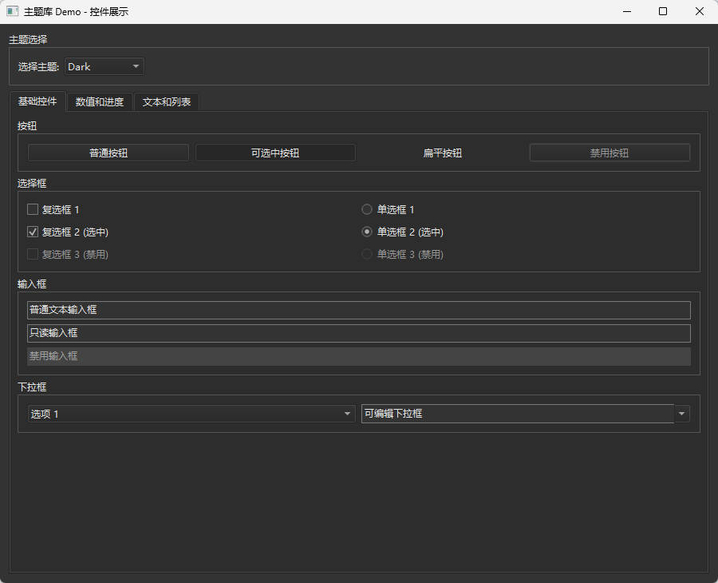
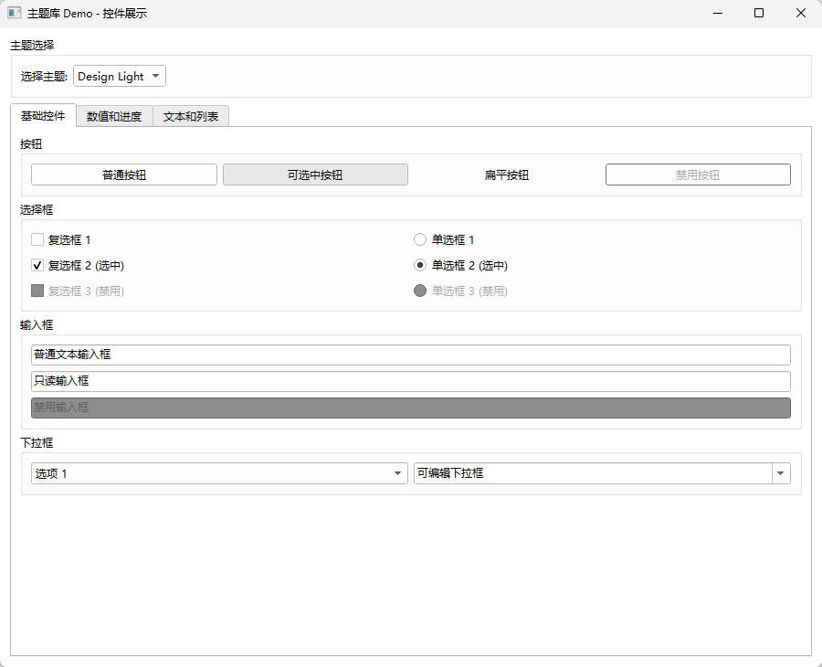
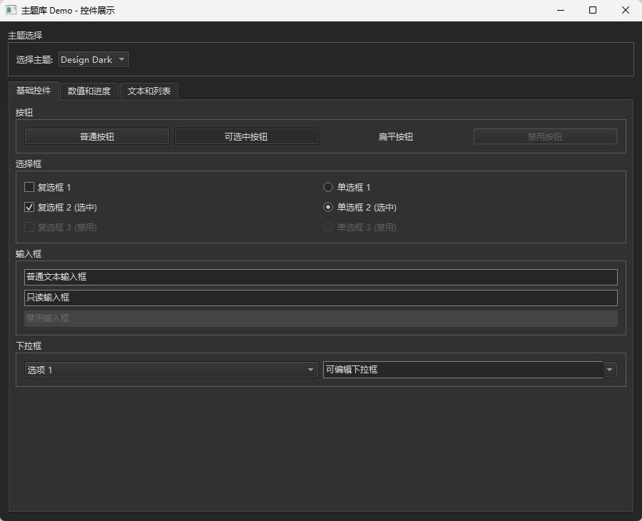
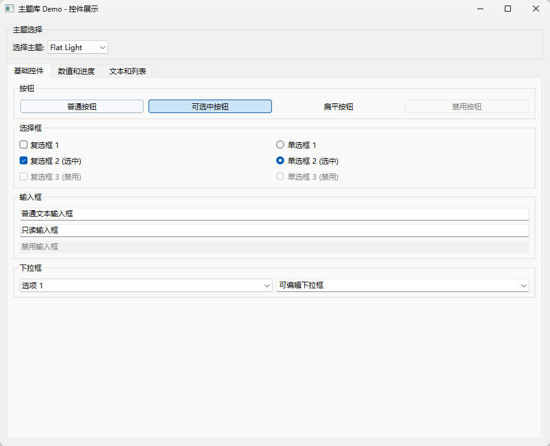
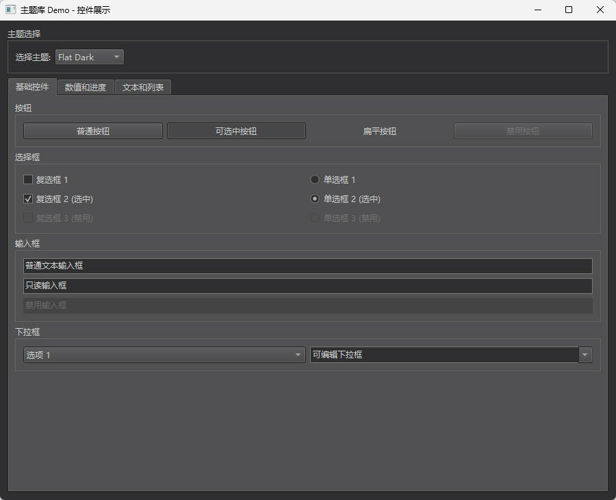

# Qt Theme Library

Qt主题库和演示程序，展示如何为Qt应用程序实现完整的主题切换功能。

## 项目结构
```
Theme/
├── ThemeDemo.pro          # 演示程序项目文件
├── main.cpp               # 主程序入口
├── SimpleThemeSelector.h/cpp  # 主题选择器组件
└── 3rdparty/theme/        # 主题库核心
    ├── coreplugin/        # 核心插件模块
    │   ├── actionmanager/ # 动作管理系统
    │   ├── editormanager/ # 编辑器管理
    │   ├── locator/       # 定位器
    │   ├── find/          # 查找功能
    │   └── dialogs/       # 对话框组件
    ├── aggregation/       # 聚合模式实现
    ├── utils/             # 工具类
    ├── SvgIcon.cpp/h      # SVG图标支持
    └── theme.pri          # 主题库构建配置
```

## 演示内容

演示程序包含多个标签页，展示各种Qt控件的主题效果：

### 基础控件
- 按钮（普通、可选中、扁平、禁用）
- 复选框和单选框
- 文本输入框
- 下拉框（普通、可编辑）

### 数值和进度控件
- 滑块（水平、垂直）
- 进度条（普通、繁忙状态）
- 数值输入框（整数、小数）

### 文本和列表控件
- 多行文本编辑框
- 列表控件（QListWidget）
- 树形控件（QTreeWidget）
- 表格控件（QTableWidget）

## 使用主题库

### 在项目中引入主题库

```qmake
# 在 .pro 文件中添加
include(path/to/theme/theme_header.pri)
include(path/to/theme/theme.pri)
```

### 使用主题选择器

```cpp
#include "SimpleThemeSelector.h"

// 创建主题选择器
SimpleThemeSelector *selector = new SimpleThemeSelector(parent);

// 连接主题变化信号
connect(selector, &SimpleThemeSelector::themeChanged, [](const QString &theme) {
    // 处理主题变化
});
```

## 截图预览

| 主题 | 预览 |
|------|------|
| Classic |  |
| Dark |  |
| Design Light |  |
| Design Dark |  |
| Flat Light |  |
| Flat Dark |  |
